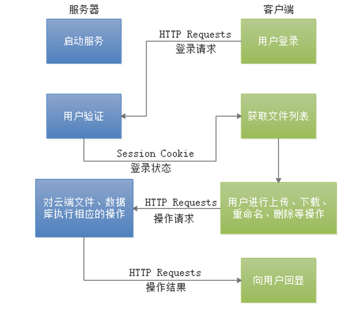
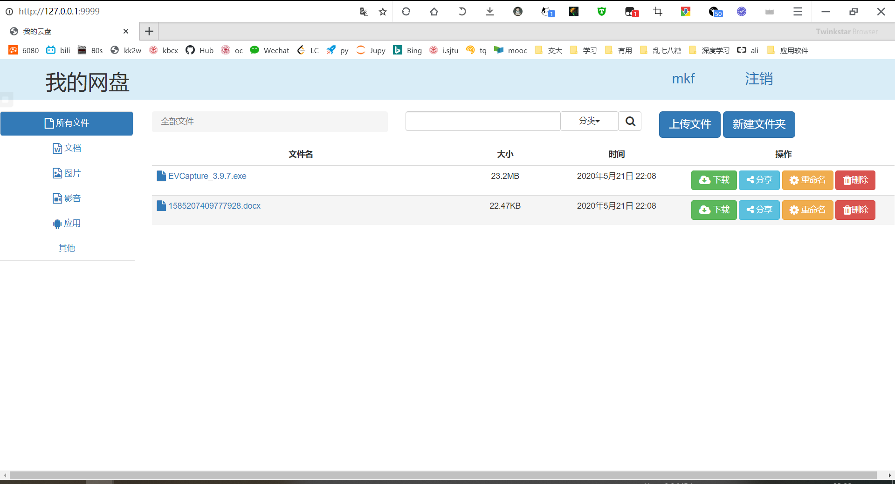
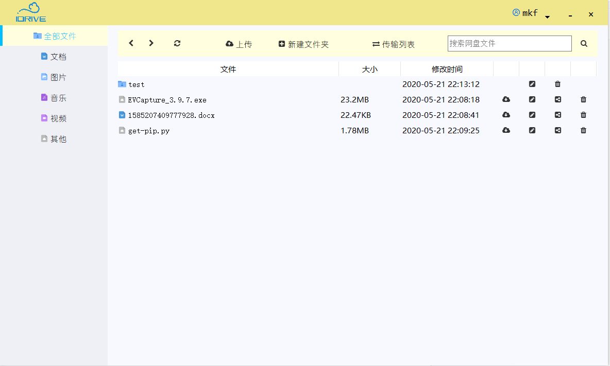

# 设计文档
    
## 1. 引言  
    
### 1.1 编写目的
    
编写本设计文档的主要目的，是为明确软件需求，安排项目规划与进度、组织软件开发、测试与部署。  
本文档可供任课老师、助教、设计人员、开发人员参考。

### 1.2 项目背景
    
项目名称：iDrive个人（企业）网盘  
项目来源：应用软件课程设计大作业  
设计单位：马可凡，邓鑫瑞，沈宸恺，李昊璋小组
    
### 1.3 项目设计特色
    
&emsp;&emsp;本团队针对市面上主流的网盘下载速度很慢、付费服务价格不菲，但高速破解软件又违法且侵犯个人隐私的问题，利用云服务器的大容量和带宽，设计了一款受众主要为个人、家庭、企业内部的网盘软件——iDrive，有效地提升了用户使用网盘的下载速度，为用户节省了大量等待时间，大大提高了用户的学习和工作效率。

- 无广告、不限速
  &emsp;&emsp;iDrive 网盘是部署在私有云服务器上的，现阶段的设计不以盈利为目的，因此不会有广告的纷扰，也不会以付费服务的形式对普通用户限速，用户使用体验很好。
    
- 大部分时间独享带宽，传输速度快
  &emsp;&emsp;iDrive 网盘面向个人、家庭或企业，用户基数小，用户在上传或下载时基本上都是独享带宽或是少数用户共享带宽，传输速度很快，能很好地满足用户对网盘的使用要求。

- 可以向非注册用户分享资源
  &emsp;&emsp;iDrive 网盘的用户原则上应该是事先指定的特定群体，对于非注册用户，开放下载分享资源的功能，以方便注册用户对资源进行共享。
    
- 多终端应用支持
  &emsp;&emsp;iDrive 网盘现在支持Web端和PC客户端两种登录使用方式，它们都提供了iDrive 网盘的完整功能。对PC用户，两种方式均可使用；对移动端用户，暂时仅可使用Web端，由于时间原因，面向移动端的App和小程序开发暂未开展。

### 1.4 项目应用前景

- 个人多终端资源备份转存
&emsp;&emsp;个人用户可以使用iDrive 网盘对PC、移动终端上的照片、文档、代码等资源数据进行备份或转存，释放PC和移动端的存储空间，防止因误操作或病毒造成数据丢失。
    
- 家庭私有云部署
&emsp;&emsp;iDrive 网盘可以用于家庭的私有云部署，提供与nas相似的功能，支持系统备份、远程下载等，并且可作为高质量（音质、画质）媒体库，为家庭影院等提供足够大的存储空间。

- 企业内部网盘
&emsp;&emsp;企业内部使用iDrive 网盘进行文件共享、代码同步与备份也是非常方便的，在局域网中部署网盘，不仅传输速度快、安全性也较高。
    
## 2. 总体架构设计  

本项目的工作流程如下图所示：

<p align="center">
	
	<p align="center">
		<em>fig 2.1- iDrive 工作流程</em>
	</p>
</p>

项目总体主要分为如下三个模块：
- 云存储服务器后端：负责存储用户上传的文件，响应用户接口的各种操作。
- Web 客户端：以Web 界面形式提供iDrive 网盘服务，提供完整的用户接口，适用于PC 和移动端。
- PC 客户端：以PC 用户界面形式提供iDrive 网盘服务，提供完整的用户接口，仅适用于PC端。

本部分对各模块的工作进行简要的介绍。

### 2.1 服务端Django 框架搭建
    
&emsp;&emsp;使用Python 的Django 框架作为云存储服务器的后端，用MySQL 存储用户、文件等记录，Web 端和PC客户端利用不同的HTTP Requests方式向后端发送请求，以执行用户相关操作并传送文件数据。
    
### 2.2 Web 端界面与业务逻辑
    
&emsp;&emsp;利用Bootstrap组件完成Web 端的界面搭建；在JavaScript 的业务逻辑中，对不同的用户操作分别使用form和ajax发送HTTP请求。
    
### 2.3 PC 客户端界面与业务逻辑
    
&emsp;&emsp;使用PyQt 完成PC 客户端的界面搭建；通过界面的槽函数将不同的用户操作连接到相应的Python 接口，调用requests 发送HTTP 请求，实现与服务器的通信。

## 3. 模块设计

### 3.1 服务端Django 框架

#### 3.1.1 数据库设计

&emsp;&emsp;本系统使用MySql数据库，除了Django内置的表格外，在数据库下创建的主要有三张表。

表名|描述
-|-
FileInfo|存放文件信息，包括文件路径、更新时间、文件大小等信息
FolderInfo|存放文件夹信息，包括更新时间、文件夹名等信息
ShareInfo|存放分享信息，包括文件名、分享期限、分享链接等信息

#### 3.1.2 数据库操作

&emsp;&emsp;iDrive网盘在服务端MySQL的root用户下建立cloud 数据库，对于用户、文件、分享等记录，则在cloud 数据库中建立相应的表。

&emsp;&emsp;服务端部署时，需要先手动创建cloud 数据库，然后进行数据库迁移。在iDrive提供的各种功能中，服务端都是通过Django的数据库接口而非数据库语句进行数据库的增删改查等操作，可以有效防止SQL注入等恶意攻击。

&emsp;&emsp;用户验证基于Django提供的验证模块，以登陆为例，每次登陆时接收用户的输入，使用authenticate函数验证账户密码是否匹配，下面给出了代码示例。

```python
if request.method == 'GET':
    username = request.POST.get('username')
    password = request.POST.get('password')
    user = auth.authenticate(username=username, password=password)
    if user:
        auth.login(request, user)
        return redirect('/')
    else:
        return render(request, 'login.html', {'info': '用户名或密码错误'})
else:
    return render(request, '404.html')
```

#### 3.1.3 与前端的通信方式

&emsp;&emsp;iDrive 网盘使用HTTP Request 实现客户端/服务器通信。在服务端的Django 框架中，声明客户端各种用户接口所对应的urls，并对每个url 绑定接收到Request 后的处理逻辑，业务逻辑完成后仍以HTTP Request 的方式向客户端返回成功情况和相应的数据。

&emsp;&emsp;后端的返回结果主要有三种方式，redirect、render和JsonReponse。前两种用于Web端，JsonResponse用于与PyQt端通信。值得一提的是，render除了返回界面外，还可以返回结构化的数据，前端使用模板引擎可以轻松地获取并处理数据。

```python
def logout(request):
    auth.logout(request)
    return redirect('/')

def page_not_found(request, exception):
    return render(request, '404.html')
```

#### 3.1.4 后端业务逻辑

&emsp;&emsp;iDrive 网盘向用户提供注册、登录、注销、上传、下载、删除、重命名、新建文件夹、分享等一系列功能。在Django 框架中，对各种功能的请求操作，先判断其来源（Web 端 或 PC 客户端），然后再读取HTTP Request 的参数，实现对应的功能。

### 3.2 Web 客户端设计

#### 3.2.1 Web 页面的获取

&emsp;&emsp;对于通过浏览器的Web 客户端访问，后端业务逻辑中会进行相应的判断，并使用render 进行页面渲染或redirect 进行页面重定向。

#### 3.2.2 Web 页面的通信

&emsp;&emsp;前端需要将数据传输给后端，在系统实现中，我们既实现了基于form的表单提交，也实现了ajax的异步通信。

```js
//以上传文件为例
$("#upload").click(function () {
    //创建FormData对象，初始化为form表单中的数据。需要添加其他数据可使用formData.append("property", "value");
    $(".progress").show();
    var formData = new FormData();

    //var formData = new FormData($('form')[0]);
    var name = $("input").val();

    formData.append("file", $("#file")[0].files[0]);

    formData.append("name", name);

    formData.append("file_path", $("#pwd").text());

    //ajax异步上传
    $.ajax({
      url: "/upload_file/",
      type: "POST",
      // async: false,
      dataType: "json",
      data: formData,
      headers: { "X-CSRFToken": $.cookie("csrftoken") },
      xhr: function () {
        //获取ajaxSettings中的xhr对象，为它的upload属性绑定progress事件的处理函数
        myXhr = $.ajaxSettings.xhr();
        if (myXhr.upload) {
          //检查upload属性是否存在
          //绑定progress事件的回调函数
          myXhr.upload.addEventListener(
            "progress",
            progressHandlingFunction,
            false
          );
        }
        return myXhr; //xhr对象返回给jQuery使用
      },
      success: function (result) {
        $("#myTable tbody").html();
      },
      contentType: false, //必须false才会自动加上正确的Content-Type
      processData: false, //必须false才会避开jQuery对 formdata 的默认处理
    });
    // window.location.reload();
  });
```

&emsp;&emsp;在向后端发送数据后，还要接收返回结果，如果返回结果不是页面，而是一些结构化的数据，可以基于jinjia模板引擎获取数据。

```python
def index(request):
  breadcrumb_list = [{'tag': '全部文件', 'uri': ''}]
  return render(request, 'index.html',
                {'breadcrumb_list': breadcrumb_list})
```

```js
<dic class="col-sm-4">
    <ol class="breadcrumb">
        
            
                <li><a href="/folder/?pdir={{ breadcrumb.uri }}">{{ breadcrumb.tag }}</a></li>
            
                <li class="active"><span id="pwd" hidden>{{ breadcrumb.uri }}</span>{{ breadcrumb.tag }}
                </li>
            
        
    </ol>
</dic>
```

#### 3.2.3 Web 页面的用户接口

&emsp;&emsp;Web 客户端使用Bootstrap 组件构建按钮、模态框等页面控件，向用户提供美观的接口，用户通过简单的点击按钮、选择文件、输入文本等，即可实现相应的操作。


### 3.3 PyQt 客户端设计

#### 3.3.1 与后端通信

&emsp;&emsp;PyQt端主要使用requests库进行通信，在用户登陆时，创建一个request.Session类，进行post与get等操作，也方便了用户认证。为了与Web端进行区分，qt在传输数据时添加了ua关键字，后端根据这个关键字执行相对应的逻辑。

&emsp;&emsp;因为PyQt端无法使用jinjia引擎，因为render和redirect方式都派不上用场，所以选择JsonResponse作为后端的返回结果。

```python
def user_login(self, username, password):
        data = {
            'username': username,
            'password': password,
            'ua': self.UA
        }
        response = self.post(f'{self.SERVER_URL}/login/?next=/', data)
        response = response.json()
        if response['login_flag']:
            return True
        else:
            return False
```

## 4. 接口说明

### 4.1 用户接口

#### 4.1.1 Web端主界面

&emsp;&emsp;注册账号并成功登陆后，用户进入网盘的主界面，用户可以在此界面选择需要使用的功能，比如上传、下载、重命名、分享文件等。界面右上角标识了当前的用户名，可以点击注销按钮注销当前用户。

<div align="center">
  </img>
  <p><em>fig 4.1-1 Web端主界面 </em></p>
</div>

#### 4.1.2 PyQt端主界面

<div align="center">
  </img>
  <p><em>fig 4.1-2 PyQt端主界面 </em></p>
</div>

### 4.2 内部接口

#### 4.2.1 路由函数

该文件定义了不同url与函数的映射关系，访问不同的url会调用相应的函数，并返回结果。

```python
from django.contrib import admin
from django.urls import path
from index import views

urlpatterns = [
    path('admin/', admin.site.urls),
    path('', views.index),
    path('delete_file/', views.delete_file),
    path('download_file/', views.download_file),
    path('upload_file/', views.upload_file),
    path('file_type/', views.file_type),
    path('search/', views.search),
    path('login/', views.login),
    path('logout/', views.logout),
    path('register/', views.register),
    path('folder/', views.folder),
    path('mkdir/', views.mkdir),
    path('delete_folder/', views.delete_folder),
    path('rename_file/', views.rename_file),
    path('rename_folder/', views.rename_folder),
    path('share_file/', views.share_file),
    path('download_share_file', views.download_share_file),

]
handler404 = views.page_not_found
handler500 = views.page_error
```

## 5. 实现难点